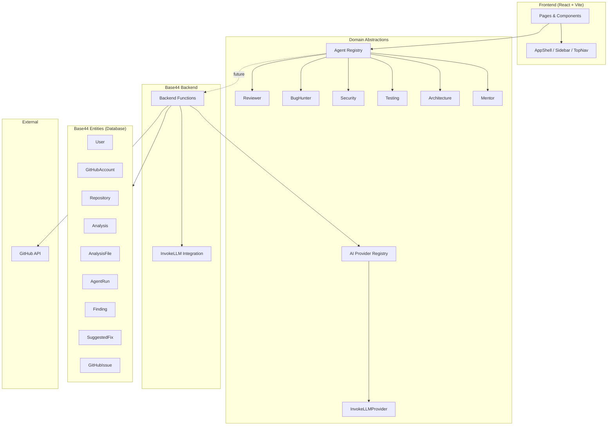
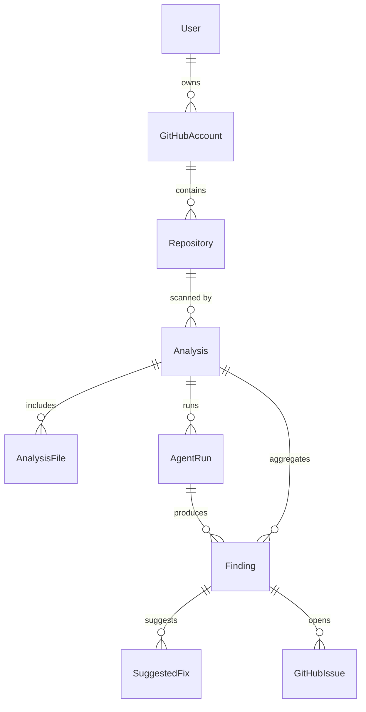

# RepoMentor AI

> Your AI code review team for GitHub.

RepoMentor AI deploys a team of specialized AI agents to analyze GitHub
repositories and produce structured, actionable findings. Each agent has a
focused specialty — code quality, bugs, security, testing, architecture —
plus a Junior Developer Mentor that explains issues in beginner-friendly
terms.

**Status: Phase 1 — Foundation.** This phase establishes the architecture,
domain models, agent & AI provider abstractions, design system, app shell,
and routes. GitHub OAuth, repository scanning, AI execution, and GitHub
Issue creation are intentionally deferred to later phases.

---

## Tech stack

RepoMentor AI is built on the **Base44** platform. The stack is adapted from
the recommended Next.js + Prisma + TypeScript stack to the platform's
first-class equivalents:

| Concern        | Recommended        | This project (Base44)                          |
| -------------- | ------------------ | ---------------------------------------------- |
| Frontend       | React + Next.js    | React + Vite + Tailwind CSS + shadcn/ui        |
| Language       | TypeScript         | JavaScript (JSX) + JSDoc types                 |
| Backend        | Next.js API routes | Base44 backend functions (`base44/functions`) |
| Database       | PostgreSQL + Prisma| Base44 entities (JSON-schema documents)       |
| Validation     | Zod                | Zod (available) + lightweight runtime guards  |
| AI             | Vendor SDK         | Base44 `InvokeLLM` integration (abstracted)   |
| Auth           | NextAuth           | Base44 Auth (email/OAuth, session-managed)     |
| Theme          | —                  | `next-themes` (dark/light)                     |

TypeScript is not available on this platform, so the codebase uses
JavaScript with JSDoc type annotations for IntelliSense and documentation,
and a strict, modular structure to keep the code maintainable.

---

## Architecture

The application is organized into clearly separated modules. Business logic
never lives inside UI components.

```
src/
├── pages/                 # Route-level React components
│   ├── Landing.jsx        # Public marketing page
│   ├── Dashboard.jsx
│   ├── Repositories.jsx
│   ├── Analysis.jsx
│   ├── History.jsx
│   └── Settings.jsx
├── components/
│   ├── layout/            # AppShell, Sidebar, TopNav, ThemeToggle, UserArea
│   ├── states/            # EmptyState, LoadingState, ErrorState
│   ├── ui/                # shadcn primitives + SeverityBadge
│   └── ThemeProvider.jsx
├── lib/
│   ├── ai/                # AI provider abstraction (AIProvider, InvokeLLMProvider)
│   ├── agents/            # Agent abstraction (AgentBase + 6 agents + registry)
│   ├── constants.js       # Agent types, severities, statuses
│   ├── agentMeta.js       # Display metadata for agents
│   └── types.js           # JSDoc type definitions
└── App.jsx                # Router + auth + theme wiring

base44/
└── entities/              # Domain models (database schema)
    ├── GitHubAccount.jsonc
    ├── Repository.jsonc
    ├── Analysis.jsonc
    ├── AnalysisFile.jsonc
    ├── AgentRun.jsonc
    ├── Finding.jsonc
    ├── SuggestedFix.jsonc
    └── GitHubIssue.jsonc
```

### Layer responsibilities

- **UI components** — presentation only; no business logic.
- **Pages** — compose components and read data; no direct AI/GitHub calls.
- **Agent abstraction (`lib/agents`)** — `AgentBase` defines the agent
  contract (`name`, `type`, `description`, `analyze()`). Six concrete agents
  declare their metadata; `analyze()` is stubbed until the AI phase.
- **AI provider abstraction (`lib/ai`)** — `AIProvider` defines the vendor
  contract (`analyze`, `generateExplanation`, `generateFix`,
  `generateIssue`). `InvokeLLMProvider` is the concrete stub. Providers are
  resolved through a registry so the app is never coupled to one vendor, and
  API keys never reach the browser (calls run in backend functions).
- **Entities (`base44/entities`)** — the database schema, defined as JSON
  schemas. Built-in fields (`id`, `created_date`, `updated_date`,
  `created_by_id`) are managed by the platform and omitted from schemas.

### Architecture diagram



### Data model relationships



---

## The agent team

| Agent         | Type           | Focus                                          |
| ------------- | -------------- | ---------------------------------------------- |
| Reviewer      | `reviewer`     | Code quality, naming, maintainability         |
| Bug Hunter    | `bug_hunter`   | Logic bugs, edge cases, race conditions        |
| Security      | `security`     | Vulnerabilities, secret leaks, dependencies    |
| Testing       | `testing`      | Coverage, assertion quality, untested paths    |
| Architecture  | `architecture` | Coupling, layering, project structure          |
| Mentor        | `mentor`       | Junior-dev explanations & learning paths        |

---

## Local setup

### Prerequisites

- Node.js (managed by the Base44 platform)
- A Base44 workspace account

### Install & run

The platform manages dependencies and the dev server. From the Base44
builder, the preview runs automatically. For local commands:

```bash
# install dependencies (platform-managed)
npm install

# start the dev server
npm run dev
```

### Environment variables

Copy `.env.example` to `.env` and fill in placeholders. On the Base44
platform, secrets (GitHub OAuth, AI keys) are managed via the platform's
secrets system, not local `.env` files — see `.env.example` for the full
configuration surface.

### Database setup

Base44 entities are the database. Schemas live in `base44/entities/*.jsonc`
and are applied by the platform — no manual migrations are required. To seed
development data, use the platform's data tools (not included by default to
avoid fake production records).

---

## Development commands

```bash
npm run dev       # start dev server
npm run build     # production build
npm run lint      # lint
```

## Testing commands

The platform validates via the production build and live preview. For
unit/integration tests, Vitest is the recommended runner (Phase 2+). End-to-
end flows are verified through the Base44 preview environment.

```bash
npm run build     # type-check + build (primary gate in Phase 1)
```

---

## Phase 1 scope

### ✅ Included

- 8 domain entities (GitHubAccount, Repository, Analysis, AnalysisFile,
  AgentRun, Finding, SuggestedFix, GitHubIssue)
- Agent abstraction (`AgentBase`) + 6 agent stubs + registry
- AI provider abstraction (`AIProvider`) + `InvokeLLMProvider` stub + registry
- App shell: sidebar, top nav, theme switch, user area
- Routes: `/`, `/dashboard`, `/repositories`, `/analysis`, `/history`,
  `/settings` + auth routes
- Design system: severity badges (critical/high/medium/low/info), empty /
  loading / error states
- Dark & light themes (`next-themes`)
- Landing page with developer-tool aesthetic
- `.env.example` + README with architecture diagrams

### ⏭️ Deferred (later phases)

- GitHub OAuth & repository access (Phase 2)
- Repository scanning (Phase 2)
- AI agent execution & analysis orchestration (Phase 3)
- Structured findings UI (Phase 3)
- GitHub Issue creation (Phase 4)
- Junior Developer Mentor mode (Phase 4)
- Full test suite (Vitest + Playwright) (Phase 2+)

---

## License

Proprietary — RepoMentor AI.
